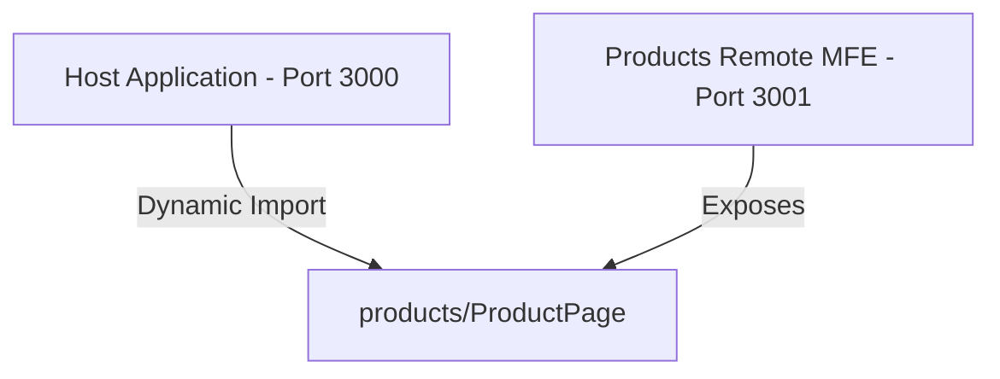

# Microfrontend Learning with Module Federation & Rsbuild

This repository is a learning project demonstrating a modern Microfrontend architecture built using [Rsbuild](https://rsbuild.rs/) and [Module Federation](https://module-federation.io/).

It consists of a **Host** shell application and a **Products** remote microfrontend.

---

## Architecture Overview



* **Host Shell (`host`):** Listens on port `3000`. It dynamically loads and renders the products page using React lazy loading and Module Federation.
* **Products Microfrontend (`products`):** Listens on port `3001`. It exposes its `./ProductPage` component to be consumed by the Host.

---

## Repository Structure

```
microfrontend-learning/
├── host/          # Host (Shell) Application
└── products/      # Products Remote Microfrontend
```

---

## Setup & Running the Application

### 1. Install Dependencies
You need to install dependencies in both the `host` and `products` directories:

```bash
# Install in Host
cd host
npm install

# Install in Products MFE
cd ../products
npm install
```

### 2. Run in Development Mode
To see the microfrontends working together, you must run both servers concurrently:

* **Start the Products MFE (Port 3001):**
  ```bash
  cd products
  npm run dev -- --port 3001
  ```

* **Start the Host Shell (Port 3000):**
  ```bash
  cd host
  npm run dev
  ```

Open your browser and navigate to [http://localhost:3000](http://localhost:3000) to view the Host application consuming the remote Products page.

---

## Technical Highlights

### ⚡ Module Federation Configuration
The host's `rsbuild.config.ts` connects to the products microfrontend using the following federation settings:
```typescript
moduleFederation: {
  options: {
    name: 'host',
    remotes: {
      products: 'Products@http://localhost:3001/remoteEntry.js',
    },
  },
}
```

### 📘 TypeScript Integration
Since the remote component is loaded dynamically over the network, TypeScript is configured in the host with a generic wildcard module declaration in `src/env.d.ts` to provide seamless, type-safe development support:
```typescript
declare module 'products/*' {
  import type React from 'react';
  const Component: React.ComponentType<any>;
  export default Component;
}
```
